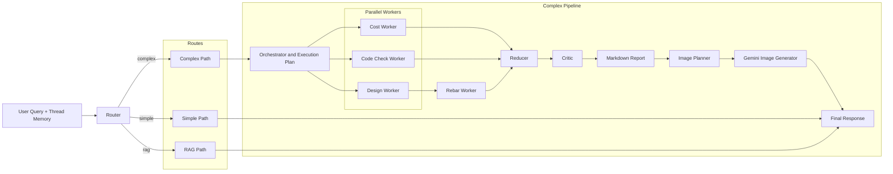
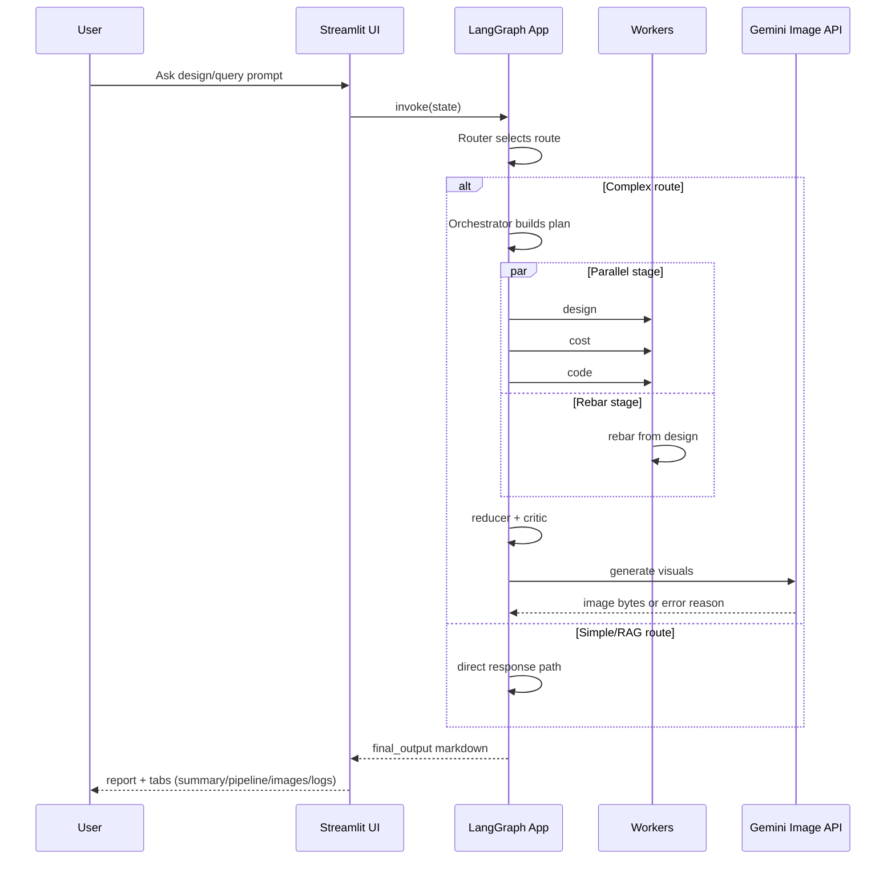

# RC Agent + Markdown RAG

Thread-aware Reinforced Concrete (RC) beam design assistant built with LangGraph, Streamlit, and retrieval from uploaded markdown.

The app supports:
- multi-turn RC design conversations
- per-thread memory and markdown retrieval (RAG)
- worker-based design/cost/code-check pipeline
- optional research via Tavily
- optional engineering image generation via Gemini

## Table of Contents

- [What This Project Does](#what-this-project-does)
- [Architecture](#architecture)
- [Project Structure](#project-structure)
- [Tech Stack](#tech-stack)
- [Requirements](#requirements)
- [Setup](#setup)
- [Environment Variables](#environment-variables)
- [Run the App](#run-the-app)
- [How the Agent Pipeline Works](#how-the-agent-pipeline-works)
- [Example Prompts](#example-prompts)
- [Output You Get](#output-you-get)
- [Troubleshooting](#troubleshooting)
- [Deployment Checklist](#deployment-checklist)
- [Known Limitations](#known-limitations)

## What This Project Does

This system acts as an RC design co-pilot focused on simply supported beam workflows.

Given a prompt like span, load, concrete grade, and steel grade, it can:
- classify intent (chat vs design vs code check)
- build an execution plan
- run design, cost, code-check, and rebar workers
- merge outputs into a structured engineering report
- optionally attach generated figures (section view and cost trade-off)

## Architecture

The architecture is built around a LangGraph state machine.


### System Architecture (Visual)



### Request Sequence (Visual)



### Core Flow

1. Router classifies intent and route.
2. Orchestrator builds an `ExecutionPlan`.
3. Workers run in parallel where possible.
4. Reducer merges results and computes final narrative.
5. Critic validates consistency and can trigger replan logic.
6. Image stage tries to create section/cost visuals and injects them into markdown.

## Project Structure

```text
iiti_intership_project_slm/
	iiti_project/
		RC_agent.py             # LangGraph orchestration + report/image pipeline
		RC_agent_frontend.py    # Streamlit UI with thread memory and debug tabs
		rc_state.py             # Pydantic/TypedDict state and contracts
		rc_tools.py             # LLM/tools, optimization, RAG ingest/search, Gemini helper
		images/                 # Generated images written at runtime
	pyproject.toml            # Python dependencies
	README.md
```

## Tech Stack

- Python 3.12+
- Streamlit UI
- LangGraph for graph orchestration
- LangChain integrations
- OpenAI models (LLM + embeddings)
- FAISS for markdown retrieval
- Tavily for optional web research
- Gemini image generation via `google-genai`

## Requirements

- Python >= 3.12
- Internet access for LLM APIs
- API keys for selected features

## Setup

### Option A: venv + pip

```bash
python -m venv .venv
source .venv/bin/activate
pip install -e .
```

### Option B: uv (if installed)

```bash
uv sync
source .venv/bin/activate
```

## Environment Variables

Create a `.env` file in repo root.

```env
# Required for core chat + embeddings
OPENAI_API_KEY=your_openai_key

# Optional: web research worker
TAVILY_API_KEY=your_tavily_key

# Optional: image generation (either variable works)
GOOGLE_API_KEY=your_gemini_or_google_ai_key
# or
GEMINI_API_KEY=your_gemini_or_google_ai_key
```

Notes:
- core design/chat uses OpenAI (`gpt-4o-mini` + `text-embedding-3-small`)
- image generation uses Gemini models and may fail if quota is exhausted

## Run the App

From repository root:

```bash
source .venv/bin/activate
streamlit run iiti_project/RC_agent_frontend.py
```

Then open the local Streamlit URL shown in terminal.

## How the Agent Pipeline Works

### Router
- Classifies: `chat`, `rc_design`, `cost_query`, `code_check`
- Selects route: `simple`, `rag`, or `complex`
- Comparison prompts are forced through full pipeline so reducer can compute deltas

### Orchestrator
- Normalizes inputs from query + sidebar defaults
- Sets optimization goal: `min_cost`, `min_steel`, `balanced`
- Builds parallel execution groups

### Workers
- `design`: section sizing and utilization
- `cost`: concrete + steel quantity/cost estimate
- `code`: flexure and minimum steel checks
- `rebar`: practical bar selection and arrangement
- `research`: optional external context enrichment

### Reducer and Critic
- merges worker outputs
- prepares engineering summary and assumptions
- validates consistency and safety messaging

### Image Stage
- prepares placeholders in markdown
- attempts Gemini generation for two visuals
- injects images into final markdown when available
- if unavailable, records explicit reason in report text

## Example Prompts

1. Baseline design

```text
Design an RCC simply supported beam for span 6.0 m and factored UDL 28 kN/m using M30 concrete and Fe500 steel. Optimize for balanced objective. Give final dimensions b and d, required steel, rebar arrangement, code safety status, utilization, estimated total cost, and a complete markdown report.
```

2. Research-backed redesign

```text
For the same beam, do a research-backed redesign to reduce cost while staying safe. Keep code checks in output.
```

3. Comparison request

```text
Now compare this design with the previous result and show cost delta and utilization delta.
```

## Output You Get

The UI provides:
- chat report (markdown)
- summary metrics
- full pipeline JSON views (plan/design/cost/code/reduced)
- generated images tab
- execution logs tab

Final markdown report typically includes:
- design summary and explanation
- dimensions and reinforcement
- cost and safety
- assumptions and conflict notes
- comparison block when applicable

## Troubleshooting

### Images show as unavailable

Check:
1. `GOOGLE_API_KEY` or `GEMINI_API_KEY` is present in `.env`
2. Gemini image quota is available (429 errors indicate exhausted quota)
3. model access is enabled for your key

### No markdown retrieval results

Check:
1. file is uploaded in current thread
2. `faiss-cpu` installed successfully
3. query is related to uploaded document content

### Import/runtime issues

Run quick checks:

```bash
python -m compileall -q iiti_project
python -c "import sys; sys.path.insert(0, 'iiti_project'); import rc_tools, RC_agent; print('ok')"
```

## Deployment Checklist

Before pushing:

1. ensure `.env` is not committed (already ignored)
2. run compile/import sanity checks
3. verify Streamlit app starts cleanly
4. verify one end-to-end design prompt
5. optionally verify image generation path if quota is available

Git flow:

```bash
git add .
git status
git commit -m "docs: add detailed README and architecture"
git push origin main
```

## Known Limitations

- current implementation is beam-focused in practice
- cost model is simplified demo estimation
- final checks are assistant-guided and not a replacement for signed structural design review
- image generation depends on external API quota and model availability

---
